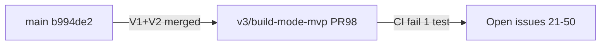
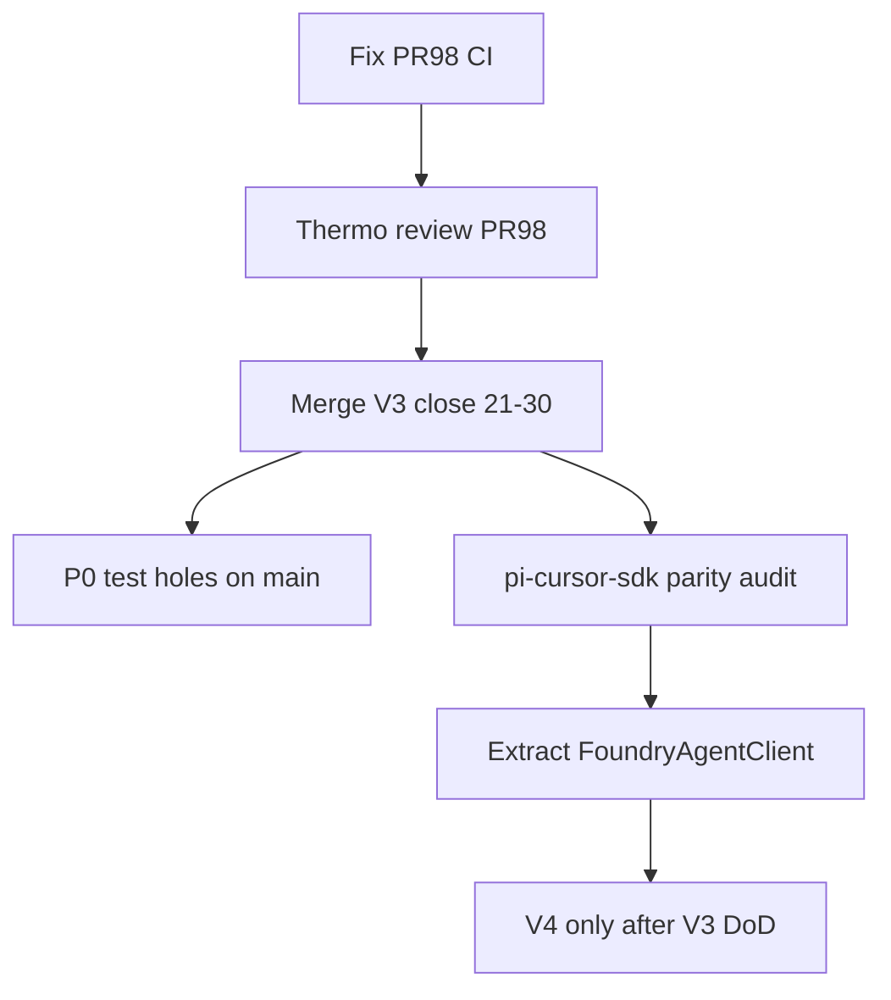

# Foundry World-Class Harness — Swarm Exploration & Alignment Plan

**Mission lock (from locked specs):** Foundry is a **planning-first AFK harness** for product building with **Composer 2.5 Standard** as default intelligence, `**@cursor/sdk` as the execution seam**, deterministic **doctor** as source of truth, and **approval-gated** external writes. V1 success on `main` is real; V3 Build MVP is **implemented on branch** `[v3/build-mode-mvp](https://github.com/kartikkabadi/foundry/tree/v3/build-mode-mvp)` in [PR #98](https://github.com/kartikkabadi/foundry/pull/98) but **not merged** (CI red; user deferred merge per `[foundry-handoff-2026-05-24.md](file:///var/folders/7c/w626kwy50ds8pwsspgc457tc0000gp/T/foundry-handoff-2026-05-24.md)`).

**Anti-slop guardrails (presumptive blockers for this program):**

- No V4/V5 feature coding until V3 merge criteria are met (unless you explicitly reprioritize in grill answers).
- No Pi fork implementation without ADR + thermo review (DECISIONS already forbid silent Pi/Cursor config mutation).
- No new “manager/registry/factory” layers without **deletion test** passing.
- No duplicate GitHub issues (#51–#90 stay closed; canonical **open** tracker is **#21–#50**).

---

## Thermo-nuclear review of *this* plan (pre-approval)

Applied the attached thermo-nuclear skill to the plan itself:


| Check                      | Verdict                                                                                                                                                                                                        |
| -------------------------- | -------------------------------------------------------------------------------------------------------------------------------------------------------------------------------------------------------------- |
| Structural regression risk | **Low** — plan is read-only exploration + docs/issues; no code dump                                                                                                                                            |
| Code-judo opportunity      | **Yes** — consolidate `src/` migration debt (already gone on `main`), fix stale `planner/dist/build` vs missing `src/build` on checkout, unify doctor+plan on one `FoundryAgentClient` seam before forking SDK |
| Spaghetti from swarm       | **Risk** — 30–40 agents can produce contradictory reports; mitigated by **5 coordinators + fixed templates + single synthesizer**                                                                              |
| File >1k lines             | **N/A** for exploration; flag `run-store.ts` (452 LOC) and `plan/orchestrate.ts` (407 LOC) for split during V3 hardening, not V4                                                                               |
| Unnecessary abstractions   | **Blocked** — SDK fork decision deferred to Track C output; default recommendation is **adapter + policy layer first**                                                                                         |
| Wrong layer                | **Blocked** — Pi fork research is **gate analysis only**, not implementation                                                                                                                                   |
| Sequential orchestration   | **Optimized** — parallel tracks with one merge doc                                                                                                                                                             |


**Approval bar for executing this plan:** Grill answers captured below + explicit approval to execute (not just iterate). Without execution approval, coordinators stay readonly.

---

## Grill answers (locked 2026-05-24)


| Decision                       | Choice                                                                                                                                                              |
| ------------------------------ | ------------------------------------------------------------------------------------------------------------------------------------------------------------------- |
| North star (4–8 weeks)         | **AFK end-to-end** — plan → approve → build → merge with minimal human touch                                                                                        |
| Pi relationship                | **Pi stays external** — adapters + auth; V4-10 runtime path; **no Pi core fork** without ADR                                                                        |
| World-class harness            | **All dimensions** — reliability, AFK autonomy, developer UX, test/red-team depth (tests ≥50% of implementation effort)                                             |
| Anti-slop                      | **All guardrails** — no V4/V5 until V3 merged + thermo-reviewed; no issue sprawl; no new packages without deletion test; no powerpack **npm** dep (guide/fork only) |
| In-house Cursor stack          | `**pi-cursor-sdk`** as **reference** for parity; **default implementation = extract portable core** into Foundry `packages/adapters` (audit before any fork)        |
| Composer policy                | **Strict Composer 2.5 only** in Foundry plan/build/doctor required paths (+ explicit fast per DECISIONS)                                                            |
| Build worker execution         | **Defer** until after V3 merge; **intended direction = hybrid** (Foundry SDK orchestration + Pi/pi-cursor-sdk only where audit justifies)                           |
| G4 live catalog                | **Signed off** by Kartik (2026-05-24) — Tier A–E in `docs/planning/LIVE_VERIFICATION.md`; powerpack extensions out of Foundry gate                                  |
| Plan direction                 | **Approved**                                                                                                                                                        |
| G4 live budget                 | **Exhaustive** — every Tier A command with live Composer where applicable                                                                                           |
| Node runtime (target)          | **Node 22.19+** — post-swarm **slice C** with DECISIONS entry; **G4 uses repo pin (Node 20)** until bump                                                            |
| Execution triggers             | See table below — single SSOT                                                                                                                                       |
| PR #98 merge                   | **Agent may merge** after G1+G2 + explicit Kartik message `merge PR #98` in chat                                                                                    |
| G4 SSOT                        | `**docs/planning/LIVE_VERIFICATION.md`** + link from issue **#30** (V3-10)                                                                                          |


### Pre-implementation decisions (status)


| Decision                                        | Status                     | Your call                                                                                                                                                    |
| ----------------------------------------------- | -------------------------- | ------------------------------------------------------------------------------------------------------------------------------------------------------------ |
| North star, Pi external, anti-slop, world-class | **Locked**                 | AFK E2E; no Pi core fork; all guardrails                                                                                                                     |
| Composer 2.5 exclusivity                        | **Locked**                 | Strict — no other Cursor models in plan/build                                                                                                                |
| In-house Cursor implementation                  | **Preferred, audit-first** | Extract core into Foundry adapters (proper CLI path); **fork pi-cursor-sdk only if audit proves Pi-side customization cannot live upstream or in powerpack** |
| PR #98 merge                                    | **Multi-gate** (see below) | Not “merge on green” alone — full verification ladder before treating main as truth                                                                          |
| Build execution model                           | **Deferred**               | Hybrid after V3 merge + parity audit                                                                                                                         |
| Fork repo name / monorepo                       | **Open**                   | Only if audit recommends a Pi extension fork (optional for powerpack)                                                                                        |
| First code slice after plan                     | **Open**                   | Likely: parallel PR #98 fix + P0 tests; adapter extract after audit doc                                                                                      |


#### Fork vs extract — why the plan mentioned fork (and your instinct is right for Foundry)

**Extract portable core into Foundry** is the **proper implementation** for the standalone CLI: one `FoundryAgentClient` seam, Composer-only policy, doctor smokes, plan/build prompts — no Pi subprocess, no Pi provider UI, no tool-bridge duplication.

**Forking `pi-cursor-sdk`** is **not** the default way to “in-house” Foundry. It only makes sense for a **different surface**:

- Interactive **Pi** sessions (powerpack users running `pi --model cursor/composer-2.5`)
- Pi-specific UX (model picker, `/cursor-fast`, tool bridge) that **should not** be copy-pasted into Foundry

If Foundry and powerpack need the **same auth/smoke/SDK call semantics**, the right shape is:

1. **Extract** shared logic into Foundry `packages/adapters` (or a small shared npm package later), and
2. **Optionally** make powerpack’s extension a **thin re-export** or depend on that package — **or** contribute patches **upstream** to fitchmultz — **not** maintain a full fork unless upstream cannot accept Composer-only / AFK constraints.

Coordinator 3’s job is to prove what is portable vs Pi-only so we do not fork by reflex.

### Three-layer Cursor stack (clarified)

```mermaid
flowchart TB
  subgraph powerpack [pi-composer-powerpack]
    ext[cursor-sdk.ts re-exports pi-cursor-sdk]
  end
  subgraph picursor [pi-cursor-sdk Pi extension]
    provider[Pi provider: cursor/composer-2.5 etc]
    bridge[Pi tool bridge + fast/thinking UX]
  end
  subgraph npm [@cursor/sdk npm]
    agent[Agent.prompt / create / local cwd]
  end
  subgraph foundry [Foundry today]
    adapter[packages/adapters/cursor.ts]
  end
  ext --> picursor
  picursor --> npm
  adapter --> npm
```


**Facts (verified):**

- [pi-cursor-sdk](https://github.com/fitchmultz/pi-cursor-sdk) is a **Pi provider extension** that runs Cursor models via local `@cursor/sdk` (auth: `CURSOR_API_KEY`, `--api-key`, or `~/.pi/agent/auth.json`; fast prefs in `~/.pi/agent/cursor-sdk.json` for **non-secret** state only).
- [pi-composer-powerpack](https://github.com/kartikkabadi/pi-composer-powerpack) wires it as `extensions/cursor-sdk.ts` → `export { default } from "pi-cursor-sdk/src/index.ts"`.
- **Foundry does not use `pi-cursor-sdk` today** — it calls `@cursor/sdk` directly in `[packages/adapters/src/cursor.ts](packages/adapters/src/cursor.ts)` and only **reads** Pi `auth.json` for keys (`[packages/core/src/config/cursor-auth.ts](packages/core/src/config/cursor-auth.ts)`).

**In-house intent (from Kartik):** Match **behavior** of the stack powerpack uses (`pi-cursor-sdk` → `@cursor/sdk`), implemented **properly** in Foundry via extracted core.

**Coordinator 3 outcomes (audit decides; default hypothesis = #1):**

1. **Extract portable core** → `packages/adapters` `FoundryAgentClient` (auth order, Composer 2.5 + fast policy, smokes, `Agent.prompt` / future `create`+stream). **Primary path.**
2. **Upstream or thin fork of pi-cursor-sdk** — **only** if Pi/powerpack need Foundry-specific hooks that do not belong in Foundry CLI (document why extract failed deletion test).
3. **Hybrid workers (post-V3)** — Foundry orchestration uses (1); optional `pi` + pi-cursor-sdk for worker paths after merge + doctor `pi-runtime` ready.

**Thermo guardrail:** No fork and no reimplementation of Pi provider + tool-bridge inside Foundry CLI without audit proof and shared test vectors.

---

## Current state (evidence snapshot)




| Area                | Fact                                                                                                                                                                            | Source                 |
| ------------------- | ------------------------------------------------------------------------------------------------------------------------------------------------------------------------------- | ---------------------- |
| `main`              | V1 + V2 complete (~106 tests)                                                                                                                                                   | `git log`, handoff     |
| V3                  | +1,852 LOC on PR #98; closes #21–#30 on merge                                                                                                                                   | `gh pr view 98`        |
| CI blocker          | `approve.test.ts` → `build passes approval gate when run is approved`                                                                                                           | handoff + PR checks    |
| Workspace on `main` | `foundry build` stub; build **source** may be branch-only                                                                                                                       | explore agent          |
| Cursor integration  | Only `Agent.prompt` in `[packages/adapters/src/cursor.ts](packages/adapters/src/cursor.ts)`; plan uses `promptComposer`, not `CursorAdapter`                                    | adapter audit          |
| Pi today            | Doctor `pi-cli` required for plan; **no Pi subprocess** in planner                                                                                                              | Pi research agent      |
| Tracker hygiene     | Dupes #61–#90 closed correctly; **#21–#50 open**                                                                                                                                | GitHub `gh issue list` |
| Doc drift           | `PUBLISHED_ISSUES.md` V1-only; `V2-V5_GITHUB_ISSUES.md` "Blocked by" refs point at dupes (#61, #81…)                                                                            | tracker agent          |
| Temp reference      | `[/var/folders/.../T/foundry-handoff-2026-05-24.md](file:///var/folders/7c/w626kwy50ds8pwsspgc457tc0000gp/T/foundry-handoff-2026-05-24.md)` + many `foundry-doctor-`* worktrees | glob                   |


---

## Hierarchical agent swarm (5 coordinators → ~25–35 leaf agents)

**Principle ([dispatching-parallel-agents](file:///Users/user/.agents/skills/dispatching-parallel-agents/SKILL.md)):** One coordinator per independent domain; each coordinator spawns 3–6 **readonly** leaf agents with **fixed output schema**; parent merges into a single section. **You** (or one **merge session**) merge the five sections—no 40-way chat.

### Coordinator 1 — Repo & architecture truth

**Leaf agents (readonly):**

1. Package boundaries + import graph vs `[tests/package-boundaries.test.ts](tests/package-boundaries.test.ts)`
2. LOC / god-module scan (`run-store.ts`, `plan/orchestrate.ts`)
3. Stale `dist/` vs `src/` (planner build, worktree types)
4. Duplicate legacy paths (README `src/` refs)
5. **improve-codebase-architecture** HTML report → temp dir (per skill; open for you)

**Deliverable:** `docs/superpowers/specs/2026-05-26-foundry-architecture-audit.md` (candidates ranked Strong → Speculative)

### Coordinator 2 — GitHub tracker & roadmap alignment

**Leaf agents:**

1. Map #21–#50 AC → existing tests (gaps table); document #11–#20 as closed on main
2. Fix proposal for `V2-V5_GITHUB_ISSUES.md` blocked-by numbers (#21 not #61)
3. PR #98 ↔ issues #21–#30 closure checklist
4. Milestone dependency sanity (V4 blocked on V3)
5. Compare `[docs/planning/V2-V5_ROADMAP.md](docs/planning/V2-V5_ROADMAP.md)` vs actual `main` + PR branch

**Deliverable:** `docs/planning/TRACKER_ALIGNMENT_2026-05-26.md` + **gh issue comment templates** (no mass close without merge)

### Coordinator 3 — Cursor stack (mechanics: pi-cursor-sdk, `@cursor/sdk`, Composer policy)

Includes former **3b** (fitchmultz audit + fork scope). **C3 = mechanics**; **C4 = policy ADR**.

**Repos to audit (readonly):**

- [fitchmultz/pi-cursor-sdk](https://github.com/fitchmultz/pi-cursor-sdk) — provider, auth order, fast/thinking, tool bridge, `@cursor/sdk` version pin
- [kartikkabadi/pi-composer-powerpack](https://github.com/kartikkabadi/pi-composer-powerpack) — `extensions/cursor-sdk.ts`, install docs, Composer 2.5 defaults
- Foundry `[packages/adapters/src/cursor.ts](packages/adapters/src/cursor.ts)` + `[packages/core/src/config/cursor-auth.ts](packages/core/src/config/cursor-auth.ts)`

**Leaf agents:**

1. Read `[sdk` skill](file:///Users/user/.cursor/skills-cursor/sdk/SKILL.md) + map **pi-cursor-sdk** and Foundry vs SDK Patterns 1–3
2. `opensrc path @cursor/sdk` + compare to pi-cursor-sdk’s pinned SDK usage
3. **Parity matrix:** auth resolution, model IDs (`cursor/composer-2.5` vs `composer-2.5`), fast defaults, smoke commands, error handling
4. **Portability verdict:** what must live in Foundry `packages/adapters` vs what must stay in Pi extension only; **fork only if justified**
5. Red-team: silent fallback, weak smoke, divergence between Pi extension and Foundry adapter

**Deliverable:** `docs/superpowers/specs/2026-05-26-pi-cursor-sdk-inhouse-options.md` with **3 options** (fork extension / extract core / hybrid) + recommendation aligned with AFK E2E + Pi-external constraint

**CONTEXT.md terms to add after your approval:** `pi-cursor-sdk`, `Cursor provider` (Pi sense vs Foundry adapter)

### Coordinator 4 — Pi, powerpack, and extension boundary (policy ADR only; no fork implementation)

**Leaf agents:**

1. DECISIONS/RUNNING_SPEC Pi narrative vs code
2. V4-10 / V5-6 / V5-9 dependency chain
3. **Powerpack ↔ Foundry:** document that powerpack’s Cursor path is **only** `pi-cursor-sdk`; list what Foundry must match for “same stack” (V5-9 guide integration)
4. Fork risk register: **pi-cursor-sdk fork** (allowed) vs **Pi core fork** (blocked without ADR)
5. Optional: scan `earendil-works/pi` (readonly) for how extensions load providers — informs V4-10, not v1 fork

**Deliverable:** `docs/adr/0000-pi-cursor-sdk-and-powerpack-gate.md` (draft ADR — **do not merge** until thermo review)

### Coordinator 5 — Testing & harness quality (50%+ framing)

**Leaf agents:**

1. Execute full audit from testing agent (P0–P3 file list)
2. TDD discipline gap vs `[test-driven-development](file:///Users/user/.agents/skills/test-driven-development/SKILL.md)` (AC-linked tests, red-first evidence)
3. CI matrix proposal: unit / fixture / optional live (`FOUNDRY_DEMO_LIVE_PLAN`)
4. V3 branch test delta vs `main` (when PR checked out)
5. Red-team catalog (composer policy, publish non-TTY, secrets in events)

**Deliverable:** `docs/superpowers/specs/2026-05-26-testing-strategy.md` with **effort budget**: 35% V1 holes / 25% harness / 25% V3 / 15% red-team

### Merge session (single human-approved session — not a 6th coordinator)

Merge five coordinator deliverables → `docs/superpowers/specs/2026-05-26-foundry-mission-alignment.md` containing:

- What to do **this week** (max 3 items)
- What to **stop**
- Issue reprioritization table (#21–#50)
- SDK fork decision gate
- Pi fork **review checklist** (not start)

---

## PR #98 / V3 merge — multi-gate ladder (not “green CI = ship”)

Kartik requirement: **do not build on broken base** — thermo pass, maximal automated tests, and **live CLI verification** in isolated temp environments before main is “truth.”


| Gate   | What                                         | Pass criteria                                                                                                                                       |
| ------ | -------------------------------------------- | --------------------------------------------------------------------------------------------------------------------------------------------------- |
| **G0** | `main` baseline                              | `npm test` + `scripts/demo.sh` green on current `main`; thermo spot-check if needed                                                                 |
| **G1** | PR #98 CI                                    | All unit tests green on `v3/build-mode-mvp` (fix `approve.test.ts` failure first)                                                                   |
| **G2** | Thermo-nuclear                               | Full PR #98 diff reviewed; no structural blockers; or explicit waive list from you                                                                  |
| **G3** | Post-merge regression (runs **after** merge) | Full `npm test` on `main`; expand matrix per testing strategy doc                                                                                   |
| **G4** | **Live rehearsal catalog** (required)        | Full matrix below in temp worktree — every command/mode we ship, real Composer where applicable, evidence log — **not** “doctor --deep + plan once” |
| **G5** | Your merge approval                          | Explicit “merge PR #98” after G1–G2; **G3–G4 must complete before V3 issues closed or adapter extract**                                             |


**Merge policy (plan default):** Merge when **G1 + G2** pass + explicit **`merge PR #98`**. Treat `main` as **production-truth** only after **G3 + G4** complete.

### Execution triggers (single SSOT)

| Trigger | Effect |
|---------|--------|
| `execute swarm` | Phase A only (coordinators + merge session + `LIVE_VERIFICATION.md`) |
| `go PR #98` | Phase B G0–G2 (may overlap Phase A) |
| `merge PR #98` | Merge after G1+G2 + explicit message |
| G3+G4 | Post-merge only |

**Execution status:** Phase A + Phase B G1/G2 executed 2026-05-26 (docs on `main`; CI fix on `v3/build-mode-mvp` @ `8281987`).

### G4 — Live verification catalog (checklist SSOT)

**Checklist SSOT:** `docs/planning/LIVE_VERIFICATION.md` (Tier A–E). **Evidence log only:** `docs/superpowers/specs/2026-05-26-live-verification-log.md`.

Run in an **isolated temp worktree** (clean clone or `git worktree`), **repo-pinned Node (20 until slice C bump)**, Pi + Cursor auth configured, `sfw npm ci`. Do not duplicate tiers in the log file.

**Tier A — CLI surface (every Foundry command)**


| Command                             | Modes / flags to exercise                                                           |
| ----------------------------------- | ----------------------------------------------------------------------------------- |
| `foundry --version`, `--help`       | baseline                                                                            |
| `foundry doctor`                    | human + `--json`; `--for setup                                                      |
| `foundry doctor --fix`              | Foundry-owned repairs only                                                          |
| `foundry setup`                     | recommended + expert; non-TTY behavior                                              |
| `foundry init`                      | fresh `.foundry/`                                                                   |
| `foundry plan`                      | rough idea; budget profiles quick/deep/marathon if wired; pause mid-run; **resume** |
| `foundry approve`                   | gate before build                                                                   |
| `foundry publish`                   | local drafts; non-TTY deny; approval-gated `gh` if configured                       |
| `foundry build`                     | preflight; dry-run; serial issue path; pause/resume (V3)                            |
| `foundry status`, `pause`, `resume` | active + completed runs                                                             |


**Tier B — Plan / build artifacts (real or fixture-backed live)**

- All V1 artifacts present and useful: `summary.md`, `prd.md`, `implementation-plan.md`, `issue-plan.md`, `build-goal.md`
- `run.json`, `status.md`, `events.jsonl` consistent after each phase
- Post-approve build: proofs per issue type (V3), worktree isolation, orchestrator review gate (HITL step documented)

**Tier C — Policy / red-team live**

- Composer **2.5 Standard** only on plan/build (strict); fast only with explicit flag + approval path
- No silent fallback when Composer unavailable (hard-fail with doctor guidance)
- Secrets absent from `.foundry/runs/*` after live plan (grep gate)

**Tier D — Ecosystem parity (not “every Pi extension”)**

Foundry does **not** re-test all of powerpack inside Foundry CI. G4 for ecosystem means:


| Check                        | Scope                                                                                                        |
| ---------------------------- | ------------------------------------------------------------------------------------------------------------ |
| **Pi + pi-cursor-sdk smoke** | `pi --model cursor/composer-2.5` + powerpack install path documented in log (proves same stack user expects) |
| **Auth parity**              | Foundry plan without manual `export CURSOR_API_KEY` when Pi auth populated                                   |
| **Doctor matrix**            | Each required check for `plan` and `build` exercised once live                                               |


**Explicitly out of G4 for Foundry repo (avoid slop):** testing every powerpack extension (agent-chain, coms, pi-pi, etc.) inside Foundry’s release gate — those belong to **powerpack’s** checklist, cross-linked from V5-9.

**Tier E — Scripts**

- `scripts/demo.sh`, `scripts/demo-build.sh` (V3), `scripts/fixture-plan-smoke.ts`, `scripts/rehearsal-live.sh` where applicable

**Coordinator 5 deliverable:** promote tiers into `docs/planning/LIVE_VERIFICATION.md` with owners and time estimates.

Until **G1** passes on PR #98, treat V3 code as **unverified**. G0 recorded: `main` 106 tests green (`b994de2`).

---

## Skills & discipline map


| Skill                              | Role in swarm                                                        |
| ---------------------------------- | -------------------------------------------------------------------- |
| thermo-nuclear-code-quality-review | Block low-quality merges; review PR #98 + any refactor proposals     |
| test-driven-development            | All *implementation* after alignment: failing test first             |
| how-to-code                        | Adapter seams, small core, replay-derived run state                  |
| agent-verification-discipline      | Every claim cites file/CI output                                     |
| brainstorming                      | **After** swarm synthesis if new *product* surface proposed          |
| grill-with-docs                    | Intent questions (separate form) → update `[CONTEXT.md](CONTEXT.md)` |
| improve-codebase-architecture      | Coordinator 1 HTML report                                            |
| dispatching-parallel-agents        | Coordinator orchestration pattern                                    |


**Matt Pocock issue template:** Continue for new/rewritten issues in `[docs/planning/V2-V5_GITHUB_ISSUES.md](docs/planning/V2-V5_GITHUB_ISSUES.md)`; add **Test proof** section mapping to concrete `tests/*.test.ts` names.

---

## Recommended strategic sequencing (locked: AFK E2E + all guardrails)




**Code-judo (high conviction, after pi-cursor-sdk audit):**

- **Parity first:** align Foundry auth order + Composer 2.5 / fast policy with pi-cursor-sdk (see README auth + `--cursor-no-fast`).
- Single module `packages/adapters/src/foundry-agent.ts` (or thin wrapper around shared package extracted from fork): **plan, doctor, build** use one seam; delete dual `CursorAdapter` vs `promptComposer` APIs.
- Shared **smoke contract** with pi-cursor-sdk (`FOUNDRY_COMPOSER_OK` or adopt pi-cursor-sdk’s smoke pattern).
- Add `tests/cursor-adapter.test.ts` + **parity tests** against pi-cursor-sdk behavior fixtures (no live network in default `npm test`).

**Defer:** Pi **core** fork, build hybrid wiring, V4/V5 features, npm publish primary. **Fork pi-cursor-sdk:** only if Coordinator 3 audit fails extract/upstream path (unlikely for Foundry CLI).

---

## Local / temp reference folder

`[/var/folders/7c/w626kwy50ds8pwsspgc457tc0000gp/T/](file:///var/folders/7c/w626kwy50ds8pwsspgc457tc0000gp/T/)`

- Treat as **historical lab artifacts** (doctor matrix experiments, chronicle OCR), not SSOT.
- Ingest only: handoff markdown, any `.foundry/config.toml` patterns worth doctor fixtures.
- Do **not** copy scattered `dist/cli.js` trees into repo.

---

## GitHub repo actions (after synthesis + your approval)


| Action                                                                                   | Owner         |
| ---------------------------------------------------------------------------------------- | ------------- |
| Update `docs/planning/V2-V5_GITHUB_ISSUES.md` blocked-by refs                            | Coordinator 2 |
| Extend `[docs/agents/issue-tracker.md](docs/agents/issue-tracker.md)` with #21–#50 index | Coordinator 2 |
| Add testing / SDK ADR issues only if gap doc proves need                                 | Merge session |
| Reprioritize labels: `blocked:v3-merge` on #31–#50                                       | Optional      |
| Close #21–#30 with proof comment on PR #98 merge                                         | Post-merge    |


---

## What this plan explicitly does NOT do

- Implement **Pi core** fork without ADR + thermo review.
- Start V4/V5 features “because the issues exist.”
- Add **npm dependency on pi-composer-powerpack** (guide-only per DECISIONS); a `**pi-cursor-sdk` fork** is a separate, ADR-gated decision after Coordinator 3.
- Reimplement pi-cursor-sdk’s Pi provider + tool-bridge inside Foundry without shared tests / fork.
- Expand agent count without coordinator merge (prevents slop reports).
- Claim “world-class” without test/CI evidence table.

---

## Success criteria for the exploration program

1. **Single alignment doc** you approve (`foundry-mission-alignment.md`).
2. **Tracker doc** with AC ↔ test mapping and corrected issue numbers.
3. `**pi-cursor-sdk` in-house options doc** (fork vs extract vs hybrid) with cost/risk and clear recommendation.
4. **Pi + pi-cursor-sdk + powerpack gate ADR draft** (review-only).
5. **Testing strategy** with P0 tests named and CI changes specified.
6. **PR #98** green + thermo-reviewed + your merge decision recorded.
7. **CONTEXT.md** updated only for terms you confirm in grill (no implementation trivia).

---

## Execution order (locked)

### Phase A — Readonly swarm (`execute swarm`) — **done 2026-05-26**

1. Five coordinators → deliverables under `docs/superpowers/specs/` + `docs/planning/`.
2. `docs/planning/LIVE_VERIFICATION.md` created; link from **#30** (manual gh comment optional).
3. Merge session → `foundry-mission-alignment.md`.
4. Node 22.19+ → **slice C** (`node-22` todo), not G4.

### Phase B — PR #98 (`go PR #98`) — **G1/G2 done; merge pending**

1. G0 on `main` (106 tests). G1: `8281987` on `v3/build-mode-mvp`. G2: `2026-05-26-pr98-thermo-review.md`.
2. **`merge PR #98`** (explicit only) → then G3 on `main`.
3. G4 → evidence in `2026-05-26-live-verification-log.md` per `LIVE_VERIFICATION.md`.

### Phase C — Implementation (after G3+G4 + alignment approval)

1. **writing-plans** → P0 tests; **defer FoundryAgentClient** until post-V3.
2. **node-22** slice: `.nvmrc`, CI, doctor + DECISIONS entry.

## Decisions you do NOT need to make yet

- Exact files to extract from pi-cursor-sdk (audit).
- Whether powerpack switches off fitchmultz upstream (only if shared package or fork exists).
- V4 parallel build / swarm shape (blocked by V3 DoD + G4).
- TUI/daemon/npm (V5).

## Decisions still needed from you (only these)

1. **Explicit “merge PR #98”** after G1–G2 (when you see thermo + CI evidence).
2. ~~**G4 live depth**~~ → **Locked + signed off** (Tier A–E).
3. **Optional:** if audit finds powerpack must diverge from upstream pi-cursor-sdk, whether to **upstream PR** vs **kartikkabadi fork** (Pi surface only).
4. ~~**Plan + G4 approval**~~ → **Done** — see final pre-flight questions (AskQuestion).
5. ~~**Pre-flight**~~ → **Complete** (see grill table).
6. **Triggers:** see Execution triggers table (`execute swarm` / `go PR #98` / `merge PR #98`).

