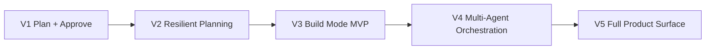
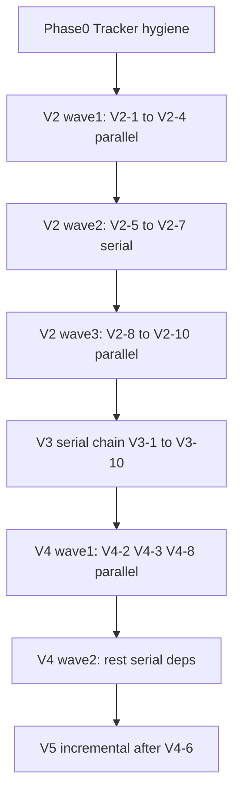

# Foundry V2–V5 Roadmap

Created: 2026-05-24  
Source: V1 merge (PR #10), `DECISIONS.md`, `RUNNING_SPEC.md`, master plan  
Status: Active — tracker SSOT for milestones V2–V5

## Product arc (V1 → V5)

| Version | User-facing promise | Primary spec source |
|---------|---------------------|---------------------|
| **V1** | Rough idea → approved plan artifacts | `V1_PLAN.md` — **done on main** |
| **V2** | Plans survive rate limits; budgets; full doctor; schema truth | `DECISIONS.md` run/resume, `OPEN_QUESTIONS.md` doctor matrix |
| **V3** | Approved plan → proof-backed issue execution | DECISIONS §Build Mode |
| **V4** | Parallel swarms, teams, reference capture, conflicts | `RUNNING_SPEC.md` exploration swarms, comms |
| **V5** | TUI, daemon, notifications, marathon runs, production scale | RUNNING_SPEC status surface + DECISIONS notifications |

## GitHub milestones

| Milestone | GitHub # | Theme | Issues |
|-----------|----------|-------|--------|
| V2 Resilient Planning | 1 | Resume, budgets, schema, doctor, modular structure | V2-1 … V2-10 |
| V3 Build Mode | 2 | Serial build, worktrees, proofs, orchestrator merge | V3-1 … V3-10 |
| V4 Orchestration | 3 | Parallel build, swarms, teams, reference capture | V4-1 … V4-10 |
| V5 Product Surface | 4 | TUI, daemon, notifications, marathon, npm | V5-1 … V5-10 |

Full issue bodies: [`V2-V5_GITHUB_ISSUES.md`](./V2-V5_GITHUB_ISSUES.md)

**Published tracker:** Issues [#11–#50](https://github.com/kartikkabadi/foundry/issues?q=is%3Aissue+is%3Aopen) (V2-1 closed as #11; active work starts at #12).

## Milestone V2 — Resilient Planning Runtime (10 issues)

**Theme:** V1 plan mode becomes production-grade: resume, budgets, schema, doctor completeness, modular structure.

**Definition of done:** Plan can be interrupted and resumed; budgets work; `foundry approve` gates build; doctor matrix complete per OPEN_QUESTIONS; no file >500 LOC without split plan.

| Slice | Title | Type | Blocked by |
|-------|-------|------|------------|
| V2-1 | Merge V1 and close tracker issues #1–#8 | HITL | — |
| V2-2 | Runtime schema validation for run.json and doctor JSON | AFK | V2-1 |
| V2-3 | Split run-writer into project-init + run-store | AFK | V2-1 |
| V2-4 | Move secrets scrub to src/config; fix adapter boundary | AFK | V2-1 |
| V2-5 | Plan checkpoint resume (re-enter orchestrate at run.phase) | AFK | V2-2, V2-3 |
| V2-6 | Wire budget profiles quick/deep/marathon to agent-pass limits | AFK | V2-5 |
| V2-7 | foundry approve command (awaiting_approval → approved) | AFK | V2-2 |
| V2-8 | Expanded doctor matrix (pi-runtime, composer-fast, browser, cuadriver, skills) | AFK | V2-1 |
| V2-9 | events.jsonl + comms thread artifacts (minimal) | AFK | V2-2 |
| V2-10 | packages/* modularization (cli, core, doctor, adapters, planner) | AFK | V2-3, V2-4 |

## Milestone V3 — Build Mode MVP (10 issues)

**Theme:** DECISIONS Build Mode hybrid — serial default, worktrees, proof, orchestrator merge.

**Definition of done:** User can approve a plan and execute issues serially with proofs; worktrees isolated; orchestrator merges; Build Goal completion criteria met.

| Slice | Title | Type | Blocked by |
|-------|-------|------|------------|
| V3-1 | foundry build command skeleton + preflight | AFK | V2-7 |
| V3-2 | Parse issue-plan.md into execution graph | AFK | V3-1 |
| V3-3 | Git worktree adapter (create, list, cleanup) | AFK | V3-1 |
| V3-4 | Serial issue worker (one issue, one worktree) | AFK | V3-2, V3-3 |
| V3-5 | Proof registry by issue type (code/ui/docs/config/research) | AFK | V3-4 |
| V3-6 | Autonomy enforcement during build (install/commit gates) | AFK | V3-4 |
| V3-7 | Orchestrator review gate before merge | HITL | V3-4 |
| V3-8 | Deferred issue recording + build-goal completion | AFK | V3-5 |
| V3-9 | foundry build resume after pause/rate-limit | AFK | V2-5, V3-4 |
| V3-10 | End-to-end fixture: plan → approve → build → proofs | AFK | V3-1–9 |

## Milestone V4 — Multi-Agent Orchestration (10 issues)

**Theme:** RUNNING_SPEC swarms, teams, reference capture, conflicts.

**Definition of done:** Parallel builds safe; research swarms with provenance; team packs; conflicts captured; reference capture feeds requirements.

| Slice | Title | Type | Blocked by |
|-------|-------|------|------------|
| V4-1 | Parallel build when issue DAG proves independence | AFK | V3-2 |
| V4-2 | Exploration swarm (multi-agent research + provenance) | AFK | V2-5 |
| V4-3 | Team spec TOML format + validator | AFK | V2-1 |
| V4-4 | Agent comms contracts (reports_to, must_publish) | AFK | V4-3 |
| V4-5 | Loop detection + agent-pass budget enforcement | AFK | V2-6 |
| V4-6 | Rate-limit checkpointing (Composer pause, no model fallback) | AFK | V2-5 |
| V4-7 | Conflict artifacts pipeline | AFK | V4-4 |
| V4-8 | Browser reference capture adapter (v1 boundary) | AFK | V2-8 |
| V4-9 | CuaDriver adapter boundary (optional capability) | AFK | V2-8 |
| V4-10 | Pi runtime adapter (beyond pi-cli check) | AFK | V2-8 |

## Milestone V5 — Full Product Surface (10 issues)

**Theme:** TUI, daemon, notifications, marathon, production — full DECISIONS vision.

**Definition of done:** Full RUNNING_SPEC modes operational; TUI + daemon; notifications; marathon runs; npm distribution; powerpack wired; verification suite matches product promise.

| Slice | Title | Type | Blocked by |
|-------|-------|------|------------|
| V5-1 | TUI consuming run.json + status.md (no schema rework) | AFK | V2-2 |
| V5-2 | Background daemon + attach/detach | AFK | V5-1 |
| V5-3 | Local macOS notifications (approval, rate limit) | AFK | V2-7 |
| V5-4 | Slack/Telegram/webhook notification adapters | AFK | V5-3 |
| V5-5 | Marathon multi-day run policy + anti-loop strictness | AFK | V4-5 |
| V5-6 | Agent-guided setup (AI loop over doctor, not deterministic only) | AFK | V4-10 |
| V5-7 | GitHub private repo creation (approval-gated) | HITL | V3-6 |
| V5-8 | npm primary distribution + self-update | AFK | V2-10 |
| V5-9 | Powerpack guide integration (agent-feedable setup path) | AFK | V5-6 |
| V5-10 | Production hardening: CONTEXT.md, full doctor lock, V5 verification suite | AFK | V5-1–9 |

## Execution waves

## Non-negotiable execution rules

Every slice follows TDD (RED → GREEN → REFACTOR), live CLI verification, and thermo-nuclear merge bar. One subagent = one issue = one worktree = one PR. Max 3 parallel worktrees on independent slices.

## Verification pyramid

| Layer | Command | When |
|-------|---------|------|
| Unit | `npm test` | Every commit |
| Integration | `bash scripts/demo.sh` | Every PR |
| Build fixture | `bash scripts/demo-build.sh` | V3+ |
| Live plan | `FOUNDRY_DEMO_LIVE_PLAN=1 scripts/rehearsal-live.sh` | V2 plan changes |
| Live build | `FOUNDRY_DEMO_LIVE_BUILD=1` | V3+ |
| CI | `.github/workflows/ci.yml` | Every push — no live Composer |
