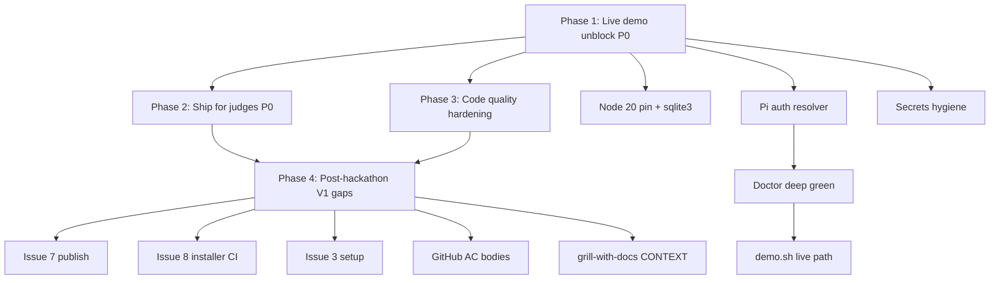

# Foundry Post-Hackathon Implementation Plan (Thermo-Nuclear Informed)

> **For agentic workers:** REQUIRED SUB-SKILL: Use superpowers:subagent-driven-development (recommended) or superpowers:executing-plans to implement this plan step-by-step. Steps use checkbox (`- [ ]`) syntax for tracking.

**Goal:** Unblock the live hackathon demo today (Node 20 + Pi-sourced Cursor API key + green `foundry doctor --for plan --deep`), ship an honest `hackathon-demo` PR for judges, harden code quality per thermo-nuclear review, then close remaining V1 gaps (#3, #7, #8, full doctor matrix).

**Architecture:** Keep the flat `src/` layout from `hackathon/integration` with strict dispatch-only CLI. Add a **canonical read-only credential resolver** (`src/config/cursor-auth.ts`) that mirrors Pi's resolution order without writing Pi config. Doctor remains the source of truth; cursor adapter consumes resolved key via injected deps (never `process.env` scattered). CI stays network-free; live smoke is opt-in via env flags. Post-V1-slice refactor moves toward `packages/*` only when Issue #8 installer lands.

**Tech Stack:** TypeScript ESM, Node 20 LTS, `@cursor/sdk` (transitive `sqlite3` native dep), Pi CLI (`~/.pi/agent/auth.json`), `tsx` + Node test runner, Socket Firewall (`sfw npm`), GitHub Actions + `gh` CLI.

---

## Thermo-Nuclear Baseline (current branch audit)

**Overall grade: B−** — Hackathon sprint target met: named modules, dispatch-only CLI, frozen doctor types, 51 passing unit tests, honest README waivers. Blockers are environmental (Node 24 + sqlite3) and architectural (API key resolution ignores Pi auth). Structural debt is manageable but will compound without Phase 3 refactors.

### Top structural findings (ordered by severity)

| # | Sev | Finding | Code-judo remedy |
|---|-----|---------|------------------|
| 1 | P0 | **Cursor API key read from `process.env` only** — ignores Pi's stored `cursor` key in `~/.pi/agent/auth.json`; live demo blocked despite Pi already configured | Single `resolveCursorApiKey()` in `src/config/cursor-auth.ts`; inject into doctor + adapter |
| 2 | P0 | **Node 24 + sqlite3 native mismatch** — local machine runs v24.14.1; `@cursor/sdk` pulls `sqlite3@5.1.7` which fails without rebuild on Node 24 | Pin Node 20 LTS (`.nvmrc` exists); tighten `engines`; add `postinstall` rebuild + doctor check |
| 3 | P1 | **`plan/secrets.ts` imported by `adapters/cursor.ts`** — cross-cutting scrubbing + future auth live in plan layer; boundary leak | Move to `src/config/secrets.ts` (scrub) + `src/config/cursor-auth.ts` (resolve) |
| 4 | P1 | **Composer smoke pass criteria too weak** — `text.length > 0` accepts any non-empty response, not `FOUNDRY_COMPOSER_OK` | Require exact marker match; fail loudly on wrong content |
| 5 | P1 | **`run-writer.ts` at 358 lines** — init, CRUD, pause/resume, formatting in one file; on path to god-module | Split: `state/project-init.ts` + `state/run-store.ts`; keep `run-writer.ts` as thin re-export during transition |

---

## Phase dependency graph



---

## Risk table

| Risk | Impact | Mitigation |
|------|--------|------------|
| **Secrets in artifacts/logs** | Credential leak in demo or PR | `scrubSecrets` on all writes; grep gate in `demo.sh`; never log resolver output; doctor reports "key found (Pi auth)" not value |
| **Reading Pi auth.json** | Accidental commit/log of key | Read-only parse; unit tests use fixture auth.json with fake keys; no `console.log` of parsed object |
| **Node version drift** | sqlite3 load failure blocks `@cursor/sdk` | `.nvmrc` + `engines` + `foundry-install` check warns on Node ≠ 20.x; CI uses Node 20 |
| **Supply-chain installs** | Compromised deps during demo prep | Always `sfw npm ci` / `sfw npm install`; CI has `socketdev/action@v1.3.1` |
| **Spec dishonesty** | Judges expect V1 complete | README waivers + PR label `hackathon-demo`; do not close Issues #6–#8 on hackathon PR |
| **Composer flake** | Live plan fails mid-demo | Rehearse 2×; 60s timeout; preflight `--deep` before run creation |
| **Thermo-nuclear debt carry** | `run-writer.ts` sprawl blocks #4 pause/resume | Phase 3 split before adding build mode |

---

## Phase 1 — Live demo unblock (P0, today)

**Thermo-nuclear approval bar:** Demo path works without manual `export CURSOR_API_KEY` when Pi has Cursor key stored. No new spaghetti branches in doctor/cursor/plan. Canonical auth resolver is the only key source. Composer smoke requires exact marker. Zero secrets in `.foundry/runs/*` after live plan.

---

### Task 1.1: Pin Node 20 LTS and fix sqlite3 for @cursor/sdk

**Files:**
- Modify: `package.json`
- Modify: `.nvmrc` (verify)
- Create: `.node-version` (optional, mirrors `.nvmrc`)
- Modify: `src/doctor/checks/foundry-install.ts`
- Modify: `.github/workflows/ci.yml` (verify node-version-file)
- Test: `tests/doctor.test.ts`

- [ ] **Step 1: Tighten engines and add postinstall rebuild**

Modify `package.json`:

```json
{
  "engines": {
    "node": ">=20 <23"
  },
  "scripts": {
    "postinstall": "npm rebuild sqlite3 --build-from-source=false 2>/dev/null || true"
  }
}
```

- [ ] **Step 2: Switch local Node to 20 LTS**

Run:

```bash
cd /Users/user/Documents/Projects/foundry
nvm install 20 && nvm use 20
node -v
```

Expected: `v20.x.x` (not v24.x)

- [ ] **Step 3: Clean install with Socket Firewall**

Run:

```bash
rm -rf node_modules
sfw npm ci
node -e "require('sqlite3'); console.log('sqlite3 ok')"
```

Expected: `sqlite3 ok` (no MODULE_NOT_FOUND / NODE_MODULE_VERSION mismatch)

- [ ] **Step 4: Add Node version warning to foundry-install check**

In `src/doctor/checks/foundry-install.ts`, after major ≥ 20 check, warn (not fail) when major > 22:

```typescript
if (major > 22) {
  return {
    id: 'foundry-install',
    status: 'warn',
    message: `Node ${deps.nodeVersion} — Foundry tested on Node 20 LTS; sqlite3 may fail on Node 24+.`,
    repair: 'Run `nvm use 20` (see .nvmrc), then `sfw npm ci && npm rebuild sqlite3`.',
  };
}
```

- [ ] **Step 5: Run tests**

Run: `npm test`
Expected: 51 tests pass, exit 0

---

### Task 1.2: Canonical Cursor API key resolver (Pi → Foundry, read-only)

**Files:**
- Create: `src/config/cursor-auth.ts`
- Create: `src/config/secrets.ts` (move from `src/plan/secrets.ts`)
- Modify: `src/adapters/cursor.ts`
- Modify: `src/doctor/checks/cursor-sdk.ts`
- Modify: `src/doctor/checks/composer-2.5-standard.ts`
- Modify: `src/doctor/deps.ts`
- Create: `tests/fixtures/pi-auth.json` (fake keys only)
- Create: `tests/cursor-auth.test.ts`
- Delete (after re-export): `src/plan/secrets.ts` imports updated

**Resolution order (document only — never log values):**

1. `process.env.CURSOR_API_KEY` — explicit override (highest priority)
2. Pi stored credential: `{PI_AGENT_DIR}/auth.json` → JSON key `cursor` with shape `{ "type": "api_key", "key": "<value>" }`
3. `null` — caller shows repair message

**Pi paths (read-only discovery, no secret reads in docs/tests logs):**

| Symbol | Default | Notes |
|--------|---------|-------|
| Pi agent dir | `~/.pi/agent` | Pi SDK default per `AuthStorage.create()` |
| Auth file | `{agentDir}/auth.json` | Credentials store; provider key name: `cursor` |
| Env override for agent dir | Discover from Pi docs / `PI_AGENT_DIR` if set | Do not hardcode user home paths in error messages beyond `~/.pi/agent` |
| Non-secret Pi state | `{agentDir}/cursor-sdk.json` | Fast-mode prefs only — **never** read API keys from here |

- [ ] **Step 1: Write failing tests for resolver**

Create `tests/fixtures/pi-auth.json`:

```json
{
  "cursor": { "type": "api_key", "key": "fixture-cursor-key-not-real" }
}
```

Create `tests/cursor-auth.test.ts`:

```typescript
import { describe, it } from 'node:test';
import assert from 'node:assert';
import path from 'node:path';
import { resolveCursorApiKey, describeCursorAuthSource } from '../src/config/cursor-auth.ts';

describe('resolveCursorApiKey', () => {
  it('prefers CURSOR_API_KEY env over Pi auth file', () => {
    const fixture = path.join(import.meta.dirname, 'fixtures/pi-auth.json');
    const key = resolveCursorApiKey({
      env: { CURSOR_API_KEY: 'env-override-key' },
      piAuthPath: fixture,
    });
    assert.strictEqual(key, 'env-override-key');
  });

  it('reads cursor key from Pi auth.json when env unset', () => {
    const fixture = path.join(import.meta.dirname, 'fixtures/pi-auth.json');
    const key = resolveCursorApiKey({
      env: {},
      piAuthPath: fixture,
    });
    assert.strictEqual(key, 'fixture-cursor-key-not-real');
  });

  it('returns null when no source available', () => {
    assert.strictEqual(
      resolveCursorApiKey({ env: {}, piAuthPath: '/nonexistent/auth.json' }),
      null,
    );
  });

  it('describeCursorAuthSource never includes key material', () => {
    const desc = describeCursorAuthSource({
      env: { CURSOR_API_KEY: 'secret-value' },
      piAuthPath: '/tmp/auth.json',
    });
    assert.ok(!desc.includes('secret-value'));
    assert.ok(desc.includes('environment') || desc.includes('CURSOR_API_KEY'));
  });
});
```

- [ ] **Step 2: Run test to verify it fails**

Run: `npm test -- tests/cursor-auth.test.ts`
Expected: FAIL — module not found

- [ ] **Step 3: Implement resolver**

Create `src/config/cursor-auth.ts`:

```typescript
import { existsSync, readFileSync } from 'node:fs';
import { homedir } from 'node:os';
import { join } from 'node:path';

export type CursorAuthSource = 'env' | 'pi-auth' | 'none';

export interface CursorAuthContext {
  env: NodeJS.ProcessEnv;
  piAgentDir?: string;
  piAuthPath?: string;
}

function defaultPiAgentDir(): string {
  return join(homedir(), '.pi', 'agent');
}

function authFilePath(ctx: CursorAuthContext): string {
  if (ctx.piAuthPath) return ctx.piAuthPath;
  const agentDir = ctx.piAgentDir ?? defaultPiAgentDir();
  return join(agentDir, 'auth.json');
}

interface PiAuthEntry {
  type?: string;
  key?: string;
}

function readPiCursorKey(authPath: string): string | null {
  if (!existsSync(authPath)) return null;
  try {
    const parsed = JSON.parse(readFileSync(authPath, 'utf8')) as Record<string, PiAuthEntry>;
    const entry = parsed.cursor;
    if (entry?.type === 'api_key' && typeof entry.key === 'string' && entry.key.trim()) {
      return entry.key.trim();
    }
  } catch {
    return null;
  }
  return null;
}

/** Returns key material — callers must never log the return value. */
export function resolveCursorApiKey(ctx: CursorAuthContext): string | null {
  const fromEnv = ctx.env.CURSOR_API_KEY?.trim();
  if (fromEnv) return fromEnv;
  return readPiCursorKey(authFilePath(ctx));
}

/** Safe for doctor output — describes source without key material. */
export function describeCursorAuthSource(ctx: CursorAuthContext): CursorAuthSource {
  if (ctx.env.CURSOR_API_KEY?.trim()) return 'env';
  const fromPi = readPiCursorKey(authFilePath(ctx));
  return fromPi ? 'pi-auth' : 'none';
}
```

Move scrubbing to `src/config/secrets.ts` (same content as current `src/plan/secrets.ts`).

- [ ] **Step 4: Wire adapter and doctor to resolver**

In `src/adapters/cursor.ts`, replace direct `process.env.CURSOR_API_KEY` with:

```typescript
import { resolveCursorApiKey } from '../config/cursor-auth.js';
import { scrubSecrets, safeErrorMessage } from '../config/secrets.js';

// inside checkComposerStandard / promptComposer:
const apiKey = resolveCursorApiKey({ env: process.env });
if (!apiKey) {
  // fail with repair pointing to Pi /login or CURSOR_API_KEY
}
```

In `src/doctor/checks/cursor-sdk.ts`:

```typescript
import { describeCursorAuthSource, resolveCursorApiKey } from '../../config/cursor-auth.js';

const source = describeCursorAuthSource({ env: deps.env });
const hasKey = resolveCursorApiKey({ env: deps.env }) !== null;

if (!hasKey) {
  return {
    id: 'cursor-sdk',
    status: 'fail',
    message: 'Cursor API key not found.',
    repair:
      'Set CURSOR_API_KEY, or store Cursor key in Pi (~/.pi/agent/auth.json via pi /login). Never commit keys.',
  };
}

return {
  id: 'cursor-sdk',
  status: 'pass',
  message:
    source === 'pi-auth'
      ? 'Cursor API key resolved from Pi auth (read-only)'
      : 'Cursor API key resolved from CURSOR_API_KEY',
};
```

- [ ] **Step 5: Run all tests**

Run: `npm test`
Expected: all pass including new cursor-auth tests

---

### Task 1.3: Strengthen Composer smoke invariant

**Files:**
- Modify: `src/adapters/cursor.ts`
- Modify: `tests/doctor.test.ts`

- [ ] **Step 1: Write failing test for weak pass**

Add to doctor or adapter tests — mock response `"hello"` should fail smoke.

- [ ] **Step 2: Require exact marker**

In `src/adapters/cursor.ts`:

```typescript
const passed =
  result.status === 'finished' &&
  text.includes('FOUNDRY_COMPOSER_OK');
// Remove: || text.length > 0
```

- [ ] **Step 3: Run tests**

Run: `npm test`
Expected: PASS

---

### Task 1.4: Green `foundry doctor --for plan --deep`

**Files:**
- Modify: none (verification task)

- [ ] **Step 1: Build and link on Node 20**

Run:

```bash
nvm use 20
sfw npm ci
npm run build
npm link
```

- [ ] **Step 2: Run deep doctor in a demo project**

Run:

```bash
mkdir -p /tmp/foundry-demo && cd /tmp/foundry-demo
git init -q
foundry init
foundry doctor --for plan --deep
echo "exit=$?"
```

Expected: exit `0`; all required checks pass including `composer-2.5-standard` (without manually exporting `CURSOR_API_KEY` if Pi auth is populated)

- [ ] **Step 3: Break-glass test — unset Pi-readable key**

Run with empty env and renamed auth (manual): doctor must exit `1` with repair message, no key echoed.

---

### Task 1.5: Update live rehearsal script

**Files:**
- Modify: `scripts/demo.sh`
- Modify: `README.md` (demo section)

- [ ] **Step 1: Add Node version gate to demo.sh**

Add after `set -euo pipefail`:

```bash
NODE_MAJOR="$(node -p "process.versions.node.split('.')[0]")"
if [ "$NODE_MAJOR" -gt 22 ]; then
  echo "WARN: Node $(node -v) — use Node 20 LTS (nvm use 20) for sqlite3/@cursor/sdk"
fi
```

- [ ] **Step 2: Add deep doctor gate before live plan**

Replace live plan precondition:

```bash
if [ "${FOUNDRY_DEMO_LIVE_PLAN:-}" = "1" ]; then
  echo "==> doctor --for plan --deep (live gate)"
  FOUNDRY_HOME="$DEMO_TMP/foundry-home" node "$ROOT/dist/cli.js" doctor --for plan --deep
  # ... plan ...
fi
```

Remove requirement for `CURSOR_API_KEY` env when Pi auth resolves key (optional env still works).

- [ ] **Step 3: Rehearse twice**

Run:

```bash
export FOUNDRY_DEMO_LIVE_PLAN=1
bash scripts/demo.sh
bash scripts/demo.sh
```

Expected: both complete; live plan artifacts present; grep finds no `CURSOR_API_KEY=` or `sk-` patterns in run dir

---

### Task 1.6: Security hygiene

**Files:**
- Modify: `.gitignore`
- Modify: `README.md`
- Verify: `src/plan/artifacts.ts`, `src/config/secrets.ts`

- [ ] **Step 1: Extend .gitignore**

Add:

```gitignore
# Pi auth fixtures with fake keys — keep local overrides out
tests/fixtures/*-local.json
*.pem
.cursor/
```

- [ ] **Step 2: Confirm scrub path on all artifact writes**

Verify `writeArtifact` and `safeErrorMessage` import from `src/config/secrets.ts`.

- [ ] **Step 3: Add doctor check that auth source is never printed**

Manual: run `foundry doctor --json | rg -i 'sk-|key_'` — expected: no matches

---

## Phase 2 — Ship for judges (P0)

**Thermo-nuclear approval bar:** PR is honest about waivers. README matches actual demo commands. No secrets in diff. Branch labeled `hackathon-demo`. CI green on Node 20.

---

### Task 2.1: Push branch and open PR

**Files:** none (git/gh operations)

- [ ] **Step 1: Preflight git**

Run:

```bash
git status
git diff main...HEAD --stat
npm test && npm run build && bash scripts/demo.sh
```

- [ ] **Step 2: Push branch**

Run:

```bash
git push -u origin hackathon/integration
```

- [ ] **Step 3: Create PR with honest scope**

Run:

```bash
gh pr create --base main --head hackathon/integration \
  --label hackathon-demo \
  --title "Hackathon demo: plan mode subset (Issues #1–#6)" \
  --body "$(cat <<'EOF'
## Summary
- Live demo path: init → doctor --deep → plan → artifacts + awaiting_approval
- Pi read-only Cursor auth resolution (no key logging)
- 51 unit tests; CI demo smoke without live Composer

## Hackathon waivers (NOT V1 complete)
- Algorithm Pass: single algorithm-pass.md
- foundry setup: stub (Issue #3 deferred)
- Issues #7–#8 deferred
- pause/resume: best-effort stub

## Test plan
- [ ] CI green
- [ ] Live demo rehearsed 2× on Node 20
- [ ] No secrets in .foundry/runs/*
EOF
)"
```

Expected: PR URL returned; label `hackathon-demo` applied

---

### Task 2.2: README demo section accuracy

**Files:**
- Modify: `README.md`

- [ ] **Step 1: Update Environment section**

Document Pi auth resolution order (env names only):

```markdown
### Cursor API key resolution (read-only)

Foundry resolves keys in this order:
1. `CURSOR_API_KEY` environment variable
2. Pi stored credential: `~/.pi/agent/auth.json` provider key `cursor`

Foundry never writes Pi auth, never logs key values, never stores keys in artifacts.
```

- [ ] **Step 2: Update demo commands**

Add Node 20 prerequisite:

```bash
nvm use 20
sfw npm ci && npm run build && npm link
foundry init
foundry doctor --for plan --deep
foundry plan "CLI that converts markdown PRDs to GitHub issues"
```

- [ ] **Step 3: Verify CI badge / workflow mentions Node 20**

Confirm `.github/workflows/ci.yml` uses `node-version-file: .nvmrc`

---

### Task 2.3: Honest waivers vs V1 claims

**Files:**
- Modify: `README.md`
- Modify: `docs/planning/OPEN_QUESTIONS.md` (link post-hackathon plan)

- [ ] **Step 1: Add "What this PR does NOT claim" section**

List explicitly:
- V1 setup wizard (#3)
- Full doctor matrix (pi-runtime, browser-capture, cuadriver, skills-team-packs)
- GitHub issue publish (#7)
- Installer + fixture smoke CI (#8)
- Full Algorithm Pass artifact set
- Build mode

- [ ] **Step 2: Update OPEN_QUESTIONS hackathon section status**

Mark hackathon matrix as **shipped**; point full matrix expansion to Phase 4.

---

## Phase 3 — Code quality hardening (thermo-nuclear)

**Thermo-nuclear approval bar:** No file crosses 500 lines without split plan. No feature logic in shared paths. Adapter/doctor/plan boundaries clean. CI vs live smoke explicitly separated. Dead code removed.

---

### Task 3.1: Split `run-writer.ts` (358 lines → focused modules)

**Files:**
- Create: `src/state/project-init.ts` — `initProject`, `getProjectFoundryDir`, `assertProjectInitialized`
- Create: `src/state/run-store.ts` — `createRun`, `readRunJson`, `writeRunState`, `listRunRefs`, pause/resume
- Modify: `src/state/run-writer.ts` — re-export public API (thin barrel)
- Test: `tests/run-writer.test.ts` (should pass unchanged)

- [ ] **Step 1: Extract project-init with no behavior change**
- [ ] **Step 2: Extract run-store**
- [ ] **Step 3: Run `npm test` — all run-writer tests pass**

**Target:** no file > 200 lines in `src/state/`

---

### Task 3.2: Consolidate config layer

**Files:**
- `src/config/cursor-auth.ts`, `src/config/secrets.ts`
- Remove: `src/plan/secrets.ts`
- Update imports in `src/plan/artifacts.ts`, `src/plan/orchestrate.ts`, `src/adapters/cursor.ts`

- [ ] **Step 1: Move secrets module**
- [ ] **Step 2: Grep for stale imports** — `rg "plan/secrets" src tests`
- [ ] **Step 3: Tests pass**

---

### Task 3.3: Doctor deps injection cleanup

**Files:**
- Modify: `src/doctor/deps.ts` — add `resolveCursorApiKey` to deps interface for testability
- Modify: `src/doctor/checks/cursor-sdk.ts` — use deps instead of direct config import

- [ ] **Step 1: Extend DoctorDeps**

```typescript
export interface DoctorDeps {
  // ...existing...
  resolveCursorApiKey: () => string | null;
  describeCursorAuthSource: () => CursorAuthSource;
}
```

- [ ] **Step 2: Default impl wraps config module**
- [ ] **Step 3: Unit tests inject fake resolver — no filesystem reads in doctor tests**

---

### Task 3.4: Remove dead code and tighten adapter

**Files:**
- Modify: `src/adapters/cursor.ts`

- [ ] **Step 1: Delete `CursorAdapterNotImplementedError`** (adapter is implemented)
- [ ] **Step 2: Add `tests/cursor-adapter.test.ts`** — mock `@cursor/sdk` dynamic import; test timeout path
- [ ] **Step 3: Separate CI-safe interface test from live smoke script**

Create `scripts/smoke-composer-live.sh`:

```bash
#!/usr/bin/env bash
set -euo pipefail
# Requires Node 20 + Pi auth or CURSOR_API_KEY
foundry doctor --for plan --deep
echo "Live Composer smoke passed"
```

Document: CI runs `demo.sh` only; live smoke is manual/`FOUNDRY_DEMO_LIVE_PLAN=1`.

---

### Task 3.5: Plan orchestration review (serial vs batch)

**Files:**
- `src/plan/orchestrate.ts`, `src/plan/prompts.ts`

**Current:** 3 sequential `Agent.prompt` calls (research → interview → synthesis). Hackathon-appropriate.

- [ ] **Step 1: Document in code comment why 3-call split is intentional** (coverage validation between interview and synthesis)
- [ ] **Step 2: Defer 2-call batch refactor to post-V1** — only if interview+synthesis merge preserves 10-slot validation
- [ ] **Step 3: Extract `updateRunPhase` helper duplication** — single `patchRun(ref, phase, artifacts)` in run-store

**Thermo-nuclear note:** do not parallelize Agent.prompt calls without approval budget policy — serial is correct for v1.

---

### Task 3.6: Test gap closure

**Files:**
- Create: `tests/cursor-adapter.test.ts`
- Create: `tests/cursor-auth.test.ts` (Phase 1)
- Modify: `.github/workflows/ci.yml`

| Gap | Fix |
|-----|-----|
| No adapter unit tests | Mock dynamic import + timeout |
| No auth resolver tests | Fixture auth.json |
| Live smoke mixed into demo.sh | `scripts/smoke-composer-live.sh` separate job (manual/workflow_dispatch) |
| No test for doctor `--json` schema stability | Snapshot test for mock report |

- [ ] **Step 1: Add adapter + auth tests**
- [ ] **Step 2: Add optional GH workflow `live-smoke.yml` with `workflow_dispatch` only** — secrets via GitHub Actions secrets, never logged

---

## Phase 4 — Post-hackathon V1 gaps (prioritized)

**Thermo-nuclear approval bar:** Each issue gets full AC from `GITHUB_ISSUE_BREAKDOWN.md`. No new god-files. Approval-gated external writes for #7. Installer (#8) includes Node 20 + supply-chain gates.

---

### Task 4.1: Issue #7 — GitHub publish (approval-gated, HITL)

**Blocked by:** hackathon PR merged, Phase 3 config layer done

**Files:**
- Create: `src/adapters/github.ts`
- Create: `src/plan/publish-issues.ts`
- Create: `src/commands/publish.ts` (or extend plan with `--publish` flag gated on approval file)
- Test: `tests/publish-issues.test.ts`

- [ ] **Step 1: Parse `issue-plan.md` into structured issue drafts**
- [ ] **Step 2: Write drafts to `.foundry/runs/<id>/github-issue-drafts/`**
- [ ] **Step 3: Require `.foundry/runs/<id>/approval.json` with `"publish_issues": true` before `gh issue create`**
- [ ] **Step 4: Record created issue URLs in run.json**
- [ ] **Step 5: Fallback to local Markdown when `gh auth status` fails**

Run: `npm test -- tests/publish-issues.test.ts`
Expected: PASS; no network in CI

---

### Task 4.2: Issue #8 — Installer + fixture smoke CI

**Files:**
- Create: `scripts/install.sh`
- Create: `tests/fixtures/rough-idea.txt`
- Create: `.github/workflows/smoke-fixture.yml` (optional separate from CI)
- Modify: `README.md`

- [ ] **Step 1: One-command installer (curl → npm install -g or npm link pattern)**
- [ ] **Step 2: Pin Node 20 in installer with nvm/fnm detection**
- [ ] **Step 3: Fixture smoke: init → plan with mocked planner in CI; live plan in workflow_dispatch**
- [ ] **Step 4: `sfw npm` in install script docs**

---

### Task 4.3: Issue #3 — Full agent-guided setup

**Files:**
- Modify: `src/commands/setup.ts`
- Create: `src/setup/loop.ts`, `src/setup/fixes.ts`

- [ ] **Step 1: Dependency-ordered fix list from V1_PLAN.md**
- [ ] **Step 2: Re-run doctor after each user action**
- [ ] **Step 3: `doctor --fix` for Foundry-owned state only**
- [ ] **Step 4: Never silently install or edit Pi/Cursor config**

---

### Task 4.4: Expand GitHub issue AC bodies

**Files:**
- GitHub issues #1–#8 via `gh issue edit`

- [ ] **Step 1: Copy full AC from `docs/planning/GITHUB_ISSUE_BREAKDOWN.md` into each issue body**
- [ ] **Step 2: Mark #1–#6 partial/complete status honestly on hackathon merge**

Run:

```bash
gh issue view 1 --json body
# Compare to GITHUB_ISSUE_BREAKDOWN.md Issue 1 AC
```

---

### Task 4.5: grill-with-docs — full doctor matrix + CONTEXT.md

**Skills:** `grill-with-docs`, `obsidian-recall-router`

**Files:**
- Create: `docs/CONTEXT.md`
- Modify: `docs/planning/DECISIONS.md` — lock full doctor matrix
- Modify: `docs/planning/OPEN_QUESTIONS.md` — close resolved branches

- [ ] **Step 1: Run grill-with-docs session on full V1 doctor matrix** (pi-runtime, composer-2.5-fast, browser-capture, cuadriver, skills-team-packs)
- [ ] **Step 2: Write CONTEXT.md** — product boundary, module map, canonical layers
- [ ] **Step 3: Add checks incrementally** — one check per PR, each with unit test

---

## Self-review (spec coverage)

| Requirement | Task |
|-------------|------|
| Node 20 LTS pin + sqlite3 | 1.1 |
| Pi → Foundry API key (read-only) | 1.2 |
| doctor --for plan --deep green | 1.4 |
| demo.sh live rehearsal | 1.5 |
| Secrets scrubbing / gitignore | 1.6 |
| Push + hackathon-demo PR | 2.1 |
| README accuracy | 2.2 |
| Honest waivers | 2.3 |
| Thermo-nuclear refactors | 3.1–3.6 |
| Issue #7 publish | 4.1 |
| Issue #8 installer CI | 4.2 |
| Issue #3 setup | 4.3 |
| GitHub AC bodies | 4.4 |
| CONTEXT.md + doctor matrix | 4.5 |

**Placeholder scan:** none — all tasks have files, commands, expected output.

---

## Execution handoff

**Plan complete and saved to `docs/superpowers/plans/2026-05-24-foundry-post-hackathon-thermo-nuclear.md`.**

**Two execution options:**

1. **Subagent-Driven (recommended)** — fresh subagent per Phase 1 task, review between tasks
2. **Inline Execution** — execute Phase 1 sequentially in one session with checkpoints

**Which approach?**
